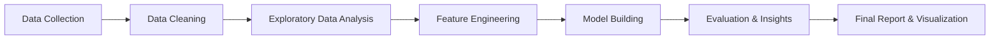

# 📊 Loan Defaulter & Bankruptcy Analysis

## A Comprehensive Data Analytics Project

## 📌 Project Overview

This project focuses on **identifying loan defaulters** and **predicting bankruptcy risk** through data cleaning, exploratory data analysis (EDA), feature engineering, and predictive modeling.

Banks and financial institutions face huge losses due to non-performing assets (NPAs). Using data-driven insights, this project helps:

* Detect high-risk customers early
* Analyze financial behavior patterns
* Build models that predict the probability of default or bankruptcy
* Assist institutions in better lending and risk-management decisions

---

## 🎯 Objectives

### **🔹 Loan Defaulter Analysis**

* Understand customer financial profiles
* Identify key factors contributing to loan defaults
* Segment customers based on risk
* Visualize repayment behavior and credit patterns

### **🔹 Bankruptcy Analysis**

* Analyze company/individual financial health
* Assess solvency, liquidity, and leverage indicators
* Identify bankruptcy predictors
* Build machine-learning models to classify bankruptcy risk

---

## 🗂️ Project Workflow

---

## 📁 Dataset Details

### **Loan Default Dataset Includes:**

* Customer demographics
* Loan amount, type, tenure
* Repayment history
* Credit score
* Employment & income data

### **Bankruptcy Dataset Includes:**

* Financial ratios (debt ratio, liquidity ratio, leverage, etc.)
* Company performance indicators
* Bankruptcy flag (0 = Healthy, 1 = Bankrupt)

---

## 🛠️ Tools & Technologies

      

---

## 📊 Exploratory Data Analysis (EDA)

### **Loan Defaulters**

* Distribution of loan amounts
* Income vs loan approval correlation
* Default rate by employment type
* Credit score impact
* EMI-to-Income ratio analysis

### **Bankruptcy Analysis**

* Trend analysis of financial ratios
* Liquidity vs Bankruptcy probability
* Debt-to-Equity comparisons
* Risk segmentation

Visualizations include:
✔ Heatmaps
✔ Boxplots
✔ Pairplots
✔ Bar/line charts
✔ Correlation matrices

---

## 🤖 Machine Learning Models Used

### **Loan Default Prediction**

* Logistic Regression
* Random Forest
* Decision Tree
* XGBoost (if dataset available)

### **Bankruptcy Prediction**

* SVM
* KNN
* Gradient Boosting
* Naive Bayes

Performance metrics:

* Accuracy
* Precision & Recall
* F1 Score
* Confusion Matrix
* ROC-AUC Curve

---

## 📌 Key Insights

### **Loan Default Findings**

* Customers with **low credit scores** have high default probability.
* High **EMI-to-income ratio** strongly correlates with non-repayment.
* Self-employed customers show higher variability in repayment.
* Loan types like personal loans have a higher default rate.

### **Bankruptcy Findings**

* **High leverage** and **low liquidity** are strong indicators of bankruptcy.
* Consistent decline in profitability ratios predicts financial distress.
* Certain industries show higher bankruptcy risk under debt pressure.

---

## 📦 Project Files

| File                          | Description                          |
| ----------------------------- | ------------------------------------ |
| `loan_default_analysis.ipynb` | Cleaning, EDA, model building        |
| `bankruptcy_analysis.ipynb`   | Financial ratio analysis & ML models |
| `datasets/`                   | Raw and cleaned datasets             |
| `visuals/`                    | Graphs & dashboard exports           |
| `README.md`                   | Project documentation                |

---

## 🚀 Future Enhancements

* Deploy ML model using Flask or FastAPI
* Build a loan risk prediction **web app**
* Add automated data pipeline
* Use deep-learning models for improved accuracy

---

## 🙌 Acknowledgements

Special thanks to publicly available datasets and open-source contributors for enabling this project.

---

## 📬 Contact

For questions or clarifications, feel free to reach out!
**Harshit Bhatt**

-   **Email**: `hbhatt579@gmail.com`
-   **LinkedIn**: [linkedin.com/in/harshitbhatt28](https://www.linkedin.com/in/harshitbhatt28/)
-   **GitHub**: [@HarshitBhatt](https://github.com/Harshit-Bhatt-sys)

---

